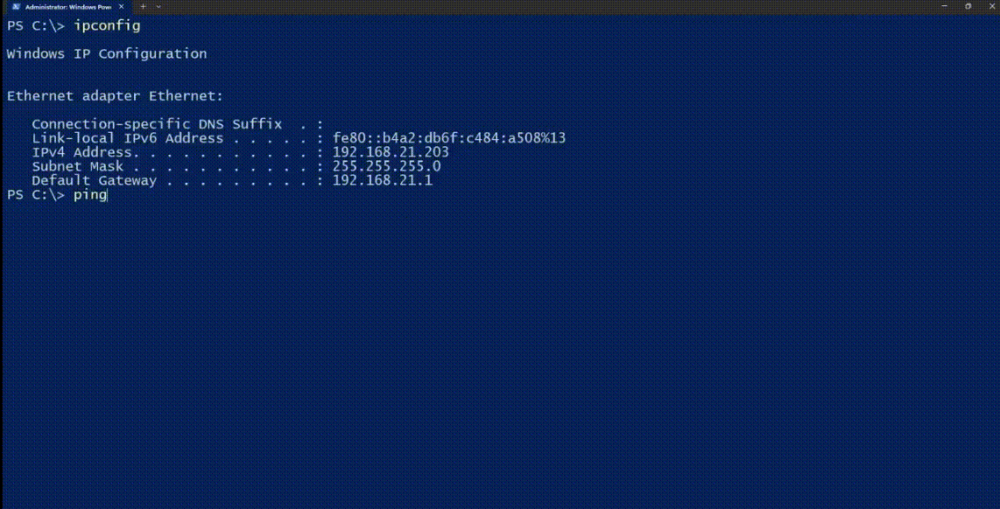
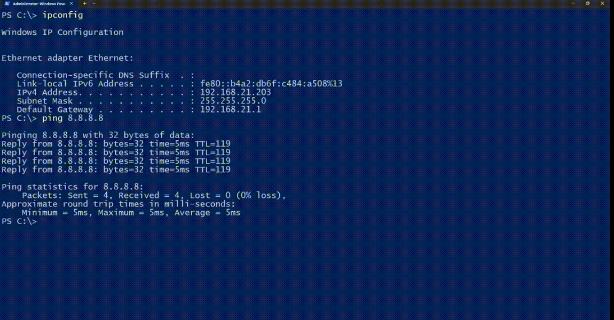

# Network-Troubleshooting

## Step 1: Check the IP Configuration
1. Type `ipconfig` in the command prompt.  
2. Verify if the user has an IPv4 address.  
3. Ensure the user's subnet mask matches the default gateway:
   - If the subnet mask is `255.255.255.0`, the first three octets must match.
   - If the subnet mask is `255.255.0.0`, only the first two octets need to match.  
4. Confirm the user is on the correct subnet for internet access.

---

## Step 2: Ping a Public IP Address
1. Type `ping 8.8.8.8` to test connectivity to a public IP (Google DNS).  
2. Check the response time:
   - Quick responses (e.g., ~5 ms) indicate good connectivity.
   - High response times or timeouts suggest issues with the network or ISP.

---

## Step 3: Ping a Domain Name
1. Type `ping google.com` to verify if DNS resolution is working.  
2. Check for replies:
   - If no reply, proceed to gather more DNS information.

---

## Step 4: Gather Detailed IP Configuration
1. Clear the screen with `cls`.  
2. Type `ipconfig /all` for a detailed view.  
3. Check the DNS server configuration:
   - If the DNS server IP is unreachable, troubleshoot the DNS or contact the ISP.

---
